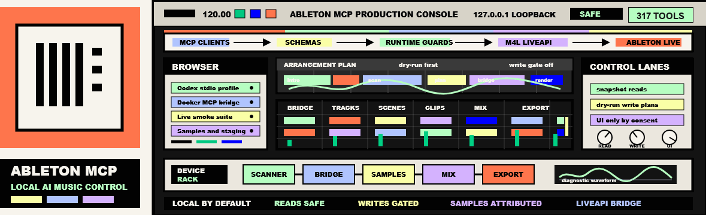
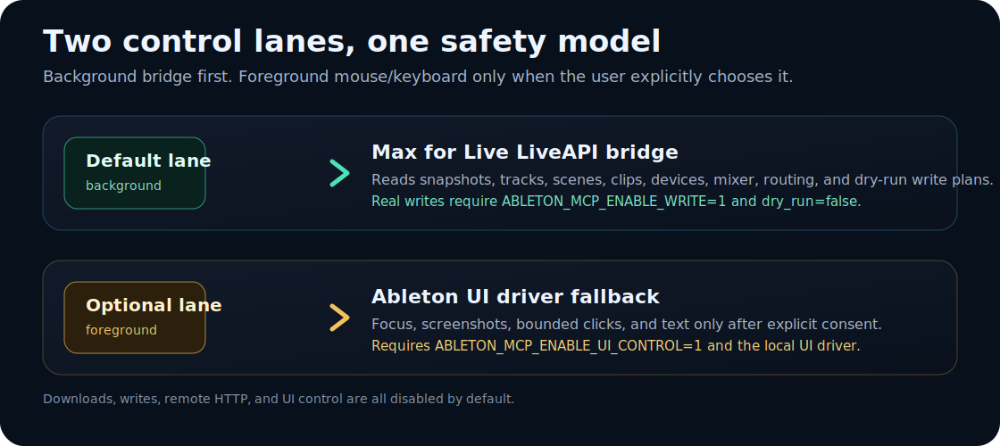
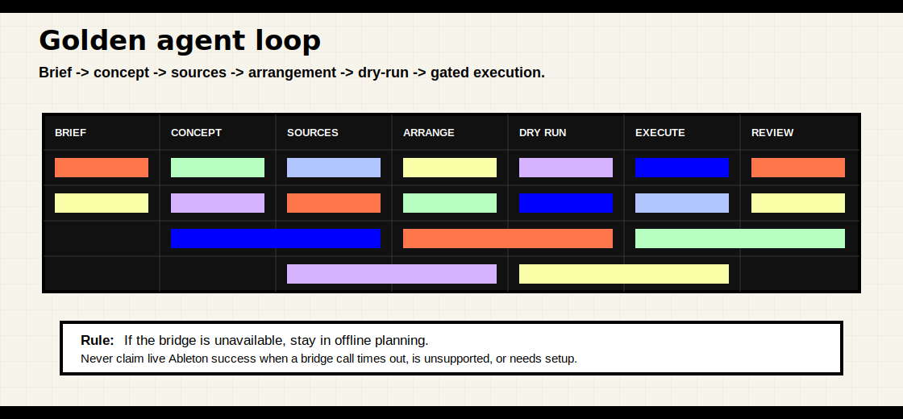

# Ableton MCP



Production-grade local MCP server for Ableton Live. Ableton MCP gives Codex, Claude, Docker MCP, WSL, OpenClaw, and other MCP-capable agents a secure way to inspect Ableton projects, reason about music production, stage samples, plan arrangements, and control Live through a Max for Live bridge.

The design goal is simple: **let an AI agent help produce music without turning the workstation into an unsafe remote-control surface.** Reads are safe by default. Writes, downloads, remote HTTP, and foreground mouse control are all explicit choices.

[](package.json)
[](tsconfig.json)
[](docs/CLIENTS.md)
[](SECURITY.md)
[](docs/TOOL_CATALOG.md)

> This project is an independent local automation layer.

## What It Does

Ableton MCP is a TypeScript/Node MCP server with a local Max for Live LiveAPI bridge, strict Zod schemas, path allowlisting, runtime guardrails, and music-production planning tools.

| Area | Capability |
| --- | --- |
| Live inspection | Read transport, tracks, scenes, clips, devices, Browser trees, Arrangement clips, mixer, sends, routing, notes, snapshots, and bridge status when the Max for Live device is loaded. |
| Gated Live control | Dry-run first write tools for tempo, scenes, clips, mixer moves, markers, MIDI notes, sample loading, Arrangement view/time helpers, and selected clip operations. |
| Producer facade | Stateful session workflow and one-call dry-run facade for brief -> blueprint -> sound palette -> assets -> execution plan -> render review -> revision -> delivery readiness through a small tool surface. |
| Producer brain | Parse briefs into tempo/key/hook/layer decisions, source usage mode, sound-design patches, arrangement moments, render review, mix scoring, revision passes, and delivery handoffs. |
| Music planning | Turn a mood/place/reference into concept plans, sample roles, arrangement timelines, device-chain specs, automation maps, mix plans, scorecards, and runbooks. |
| Sample intelligence | Build a bounded local sample index, search source packs by role, plan sample chops, search free-source registries, inspect Internet Archive/Freesound metadata, stage only approved downloads, preserve attribution, analyze key/BPM/features, and suggest loop points. |
| Library and set analysis | Scan only approved Ableton roots on demand, index samples/presets/clips/templates, and summarize `.als` files read-only. |
| UI fallback | Optional ChromeDriver-style Ableton-window focus, screenshots, clicks, and typing when LiveAPI cannot reach a control. Disabled by default. |
| Client setup | Generate configs for Codex, Claude Desktop, Cursor, Docker MCP, WSL, OpenClaw, localhost HTTP, and private-network HTTP. |
| Runtime hardening | Tool schemas, response-size limits, per-tool rate limits, short read caches, bridge queue serialization, path security checks, and verification sweeps. |

## Quick Start

```powershell
cd C:\Users\LIZ\Desktop\MCP\ableton-mcp
.\launch.ps1 setup
.\launch.ps1 stdio -SkipSetup
```

For Git Bash, WSL, macOS, or Linux-style shells:

```bash
./launch.sh setup
./launch.sh stdio --skip-setup
```

First setup installs dependencies if needed, builds `dist`, installs the Max for Live bridge files into the Ableton User Library preset path, and writes generated client configs under `config/generated/`. That generated folder is ignored because private HTTP configs can contain bearer tokens.

## Launch Modes

| Mode | Command | Purpose |
| --- | --- | --- |
| Regular MCP | `.\launch.ps1 stdio` | Local stdio MCP for Codex, Claude Desktop, Cursor, and similar clients. |
| Docker/HTTP MCP | `.\launch.ps1 docker` | Streamable HTTP MCP on `http://127.0.0.1:17366/mcp`. |
| Private remote HTTP | `.\launch.ps1 docker -RemoteHttp -HttpToken "<token>"` | Private-network/Tailscale use only. Never expose publicly. |
| Setup | `.\launch.ps1 setup` | Build, install bridge files, and generate client configs. |
| Verify | `.\launch.ps1 verify` | Build and run the MCP verifier. |
| Full check | `.\launch.ps1 check` | Build, lint, tests, doctor, release check, sweeps, verifier, and audit. |
| Ready check | `.\launch.ps1 ready -SkipSetup` | Reboot-safe readiness JSON for Node/npm, ffmpeg, build output, MCP tools, generated configs, sample root, doctor/verifier expectations, and bridge listener status. |
| Bridge status | `.\launch.ps1 bridge-status -SkipSetup` | Check bridge files, Ableton process, and listener state. |
| Live smoke | `.\launch.ps1 live-smoke -SkipSetup` | Read-only/dry-run bridge confidence report. |
| Concept demo | `.\launch.ps1 concept-demo -SkipSetup` | No-write concept-to-arrangement MCP workflow. |
| Producer demo | `.\launch.ps1 producer-demo -SkipSetup` | No-write producer-facade MCP workflow with session, blueprint, palette, execution plan, and score. |
| UI driver | `.\launch.ps1 ui-driver` | Optional foreground Ableton UI control lane. |

## Architecture

```text
MCP client -> stdio or HTTP transport -> TypeScript MCP server
                                         |-> Max for Live bridge -> Ableton LiveAPI
                                         |-> UI driver fallback -> Ableton window
                                         |-> scanner/cache/docs/sample intelligence
```



The background bridge is the preferred control path. It communicates with a Max for Live device over `127.0.0.1:17364` and serializes requests so concurrent MCP calls do not overlap inside Ableton. The foreground UI driver is a separate fallback on `127.0.0.1:17365` and requires explicit user opt-in.

## Safety Model

The default environment is conservative:

```text
ABLETON_MCP_ENABLE_WRITE=0
ABLETON_MCP_ENABLE_UI_CONTROL=0
ABLETON_MCP_ENABLE_DOWNLOADS=0
ABLETON_MCP_HTTP_ALLOW_REMOTE=0
ABLETON_MCP_SAMPLE_LIBRARY_ROOT=
```

| Gate | Default | Enables |
| --- | --- | --- |
| `ABLETON_MCP_ENABLE_WRITE=1` | Off | Real Ableton write actions after dry-run review. |
| `ABLETON_MCP_ENABLE_UI_CONTROL=1` | Off | Foreground UI-driver focus, screenshots, clicks, and typing. |
| `ABLETON_MCP_ENABLE_DOWNLOADS=1` | Off | Approved sample/package staging with attribution metadata. |
| `ABLETON_MCP_HTTP_ALLOW_REMOTE=1` | Off | Private-network HTTP binding with a bearer token. |
| `ABLETON_MCP_SAMPLE_LIBRARY_ROOT=<path>` | `samples/staging` | Optional external sample library root for large staged sample packs. |

Allowed roots are intentionally narrow:

```text
C:\Users\LIZ\Desktop\MCP\ableton-mcp
C:\Users\LIZ\Documents\Ableton
C:\ProgramData\Ableton\Live 12 Trial
optional: ABLETON_MCP_SAMPLE_LIBRARY_ROOT
```

The Ableton install root is read-only. Broad user folders, AppData, browser profiles, credential folders, password stores, raw private-network URLs, non-HTTPS sample URLs, arbitrary shell execution, plugin installers, and broad filesystem scans are rejected.

### Private Experiment Vs Release Candidate

Source review is mode-aware:

| Mode | Behavior |
| --- | --- |
| `private_experiment` | Missing license/source info does not block experimentation, but sources are still recorded as `unverified` or `experiment_only` in a manifest. |
| `release_candidate` | Unverified or experiment-only sources become release blockers or warnings before packaging. |

This is source-policy behavior only. It does not enable downloads, Ableton writes, UI/mouse control, remote HTTP, arbitrary URL scraping, or broad filesystem access.

## Music Agent Workflow



For production agents, the normal loop is:

1. Read the brief and constraints.
2. Choose `private_experiment` or `release_candidate` source mode.
3. Parse the brief into mood, tempo, key, hook, layer, and negative-space decisions.
4. Build or search sample intelligence when local samples are needed.
5. Curate source/sample candidates and analyze musical fit.
6. Build sound-design, arrangement, automation, and mix plans.
7. Review the execution action matrix and runbook.
8. Dry-run every write-capable action.
9. Execute only after the user enables the relevant gate.
10. Render, analyze, compare, revise, export stems, and preserve attribution.

Recommended first MCP calls:

```text
ableton_mcp_get_client_bootstrap_bundle
ableton_mcp_get_objective_readiness_report
ableton_mcp_get_launch_readiness_audit
ableton_get_production_readiness
ableton_produce_track_from_brief
ableton_plan_agent_music_session
ableton_get_project_usage_mode
ableton_parse_music_brief
ableton_get_capability_matrix
```

The workflow stays useful even when Ableton is closed: concept planning, sample search, set analysis, library search, device-chain planning, mix planning, and dry-run execution reports all work without pretending that live bridge actions succeeded.

## Client Compatibility

| Client/runtime | Recommended transport | Notes |
| --- | --- | --- |
| Codex | stdio | Use checked-in `.mcp.json` or generated config. |
| Claude Desktop | stdio | Same-device use is safest. |
| Cursor | stdio | Use generated config from setup. |
| Docker MCP | Streamable HTTP | Start `.\launch.ps1 docker`; safe allowlist available from MCP. |
| WSL | Windows launcher or native verifier | Use Windows host control for Ableton; native WSL is useful for headless checks. |
| OpenClaw | Streamable HTTP consumer | Add Ableton MCP as an outbound MCP server; keep Ableton MCP as the permission owner. |
| Ollama / llama.cpp | Host-dependent | Use an MCP-capable wrapper around the local model runtime. |
| OpenRouter / Gemini | Host-dependent | Configure Ableton MCP in the MCP-capable app that uses those models. |
| Private device | Tokenized Streamable HTTP | Prefer Tailscale/VPN and verify actual listener/firewall exposure. |

See [Client compatibility](docs/CLIENTS.md) and [Model runtime compatibility](docs/MODEL_RUNTIME_COMPATIBILITY.md) for exact commands and caveats.

## Tool Surface

Current verified surface:

```text
MCP tools: 317
Resources: 3
Prompts: 2
Docker MCP default safe tools: 206
Default HTTP endpoint: http://127.0.0.1:17366/mcp
```

Inspect the live catalog:

```powershell
npm run inspect
```

Run the verifier:

```powershell
npm run verify:mcp
```

Useful resources and prompts:

```text
Resources:
- ableton://environment
- ableton://runtime
- ableton://scan-status

Prompts:
- ableton-safe-production-session
- ableton-security-review
```

## Max for Live Bridge

Install bridge files:

```powershell
npm run bridge:install
```

Load this device in Ableton:

```text
bridge\max-for-live\ableton-mcp-bridge.maxpat
```

Keep these companion files together:

```text
Ableton MCP Bridge.amxd
ableton-mcp-bridge.maxpat
ableton-mcp-http.js
ableton-mcp-liveapi.js
ableton-mcp-status.js
package.json
```

Then run:

```powershell
.\launch.ps1 live-smoke -SkipSetup
```

If the bridge is not loaded, MCP reports setup steps and structured errors instead of fake success.

## Sample And Render Workflows

The repository includes local render/source-staging scripts used for verification and music-production experiments. Generated audio and staged source files are ignored by Git.

| Script | Purpose |
| --- | --- |
| `npm run stage:mall-at-the-end-of-sleep:sources` | Stage fixed Public Domain Mark Internet Archive source WAVs for the Mall project. |
| `npm run render:mall-at-the-end-of-sleep` | Render a 1980s mall dream track with fresh sources plus original synthesis. |
| `npm run render:spy-radio-horror` | Render a single-source backrooms horror track from the provided `spy-radio-station-34545 - evil chopped reverse edit.mp3`. |
| `npm run render:the-atrium-below-the-world` | Render a fully procedural 1980s mallcore / underwater vaporwave track with no reused sources. |
| `npm run render:the-road-has-no-horizon` | Render a fully procedural horror track with no source samples. |
| `npm run render:infinite-nowhere-protocol` | Render a separate horror track project from staged public-domain sources. |

Project notes:

- [Mall at the End of Sleep](docs/MALL_AT_THE_END_OF_SLEEP.md)
- [Spy Radio: Bad Trip Station](docs/SPY_RADIO_HORROR.md)
- [The Atrium Below The World](docs/THE_ATRIUM_BELOW_THE_WORLD.md)
- [The Road Has No Horizon](docs/THE_ROAD_HAS_NO_HORIZON.md)
- [Infinite Nowhere Protocol](docs/INFINITE_NOWHERE_PROTOCOL.md)

## Development

```powershell
npm install
npm run build
npm run lint
npm test
npm run verify:mcp
npm run sweep:safe
npm audit --audit-level=moderate
```

Full local release-style check:

```powershell
.\launch.ps1 check -SkipSetup
```

The scanner does not run a full library scan at startup. Use explicit scan/search tools or launcher checks when you want fresh local index data.

## Documentation

| Document | Purpose |
| --- | --- |
| [Architecture](docs/ARCHITECTURE.md) | Server layers, middleware, cache, bridge, and control model. |
| [Security](SECURITY.md) | Gates, path policy, network policy, and runtime guardrails. |
| [Agent installer](docs/AGENT_INSTALLER.md) | Universal setup guide for MCP clients and optional skill trees. |
| [Launch modes](docs/LAUNCH.md) | Launcher behavior and command matrix. |
| [Ableton bridge](docs/ABLETON_BRIDGE.md) | Max for Live bridge installation and LiveAPI notes. |
| [Ableton UI driver](docs/ABLETON_UI_DRIVER.md) | Optional foreground UI control contract. |
| [Client compatibility](docs/CLIENTS.md) | Codex, Claude, Docker MCP, WSL, OpenClaw, OpenRouter, Gemini, llama.cpp, and private-device setup. |
| [Tool catalog](docs/TOOL_CATALOG.md) | High-level tool groups and current tool count. |
| [Tool reference](docs/TOOL_REFERENCE.md) | Inspection commands and MCP context reference. |
| [Reference comparison](docs/REFERENCE_AHUJASID_COMPARISON.md) | Comparison against `ahujasid/ableton-mcp` and adopted Browser/Arrangement gaps. |
| [Producer brain](docs/PRODUCER_BRAIN.md) | Source usage modes, brief parsing, sound design, render review, mix scoring, revision loops, and handoff tools. |
| [Concept to music](docs/CONCEPT_TO_MUSIC.md) | Staged production workflow from idea to arrangement plan. |
| [Natural language to music](docs/NATURAL_LANGUAGE_TO_MUSIC.md) | How agents should translate user requests into musical actions. |
| [Music production skills](docs/MUSIC_PRODUCTION_SKILLS.md) | Producer-skill roadmap mapped to current and future tools. |
| [Sample policy](docs/SAMPLE_POLICY.md) | License, attribution, staging, and import rules. |
| [Sample sources](docs/SAMPLE_SOURCES.md) | Approved source types and source-search policy. |
| [Plugin policy](docs/PLUGIN_POLICY.md) | Plugin/package discovery and no-install safety policy. |
| [Final verification](docs/FINAL_VERIFICATION.md) | Latest local verification notes and expected runtime gaps. |

## Current Verification Snapshot

Latest checked status in this workspace:

```text
Build: passed
Lint: passed
Tests: 27 files, 128 tests passed
MCP verifier: passed, 317 tools, 3 resources, 2 prompts
Ready check: passed, sample root G:\AbletonMCP\SampleLibrary, 618.29 GB free
Safe sweep: passed, 201 safe calls, 0 unexpected failures
All-tool sweep: passed, 317 calls, 0 unexpected failures
Audit: 0 vulnerabilities
```

Expected runtime gaps:

- Live bridge calls return setup errors until the Max for Live bridge device is loaded in Ableton.
- Freesound API search can require `FREESOUND_API_KEY`.
- Downloads, imports, writes, remote HTTP, and UI/mouse control remain blocked unless their gates are explicitly enabled.

## License And Attribution Notes

Code and documentation licensing should be reviewed before public release if no repository license has been added yet. Sample metadata and staged downloads must keep attribution sidecars. Generated audio, diagnostics, caches, and staged source files are ignored by default.
